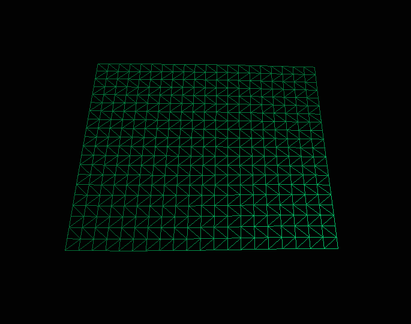
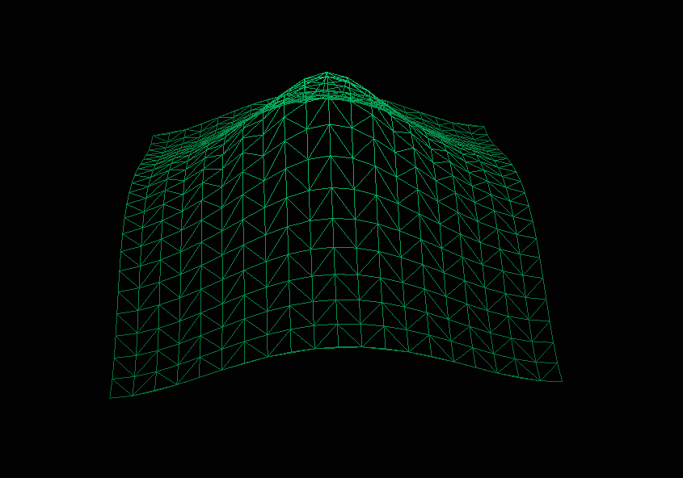
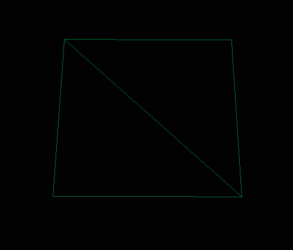
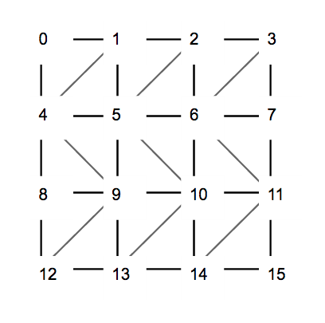

#Introduction

In this file, we will discuss algorithmic and architecural choices we made for this hydrodynamic simulation.
We will assume a general knowledge of OOP, C/C++ language and OpenGL of our readers.
We will not discuss every aspect of the source code, but rather focus on what's interesting to us.

#Architecture

**Friend or foe?**

This programm revolves around a simple *Model* / *View* couple.
The *Model* class is in charge of building every elements needed by the View class in order to display the simulation.
To keep our files clean and of reasonable length, we chose to divide our *Model* into multiple classes, each one
being a component of the scene we are trying to render.

The division occurs following this logic:
To draw an independant OpenGL object, we need to create several buffers:
- Vertices buffer
- Elements buffer
- Colors buffer
- Normals buffer
- Positions buffer (for instances only)

Each of the following classes needs its own buffers, hence the separation: 

- Terrain
- Borders
- Water
- WaterBorders
- Drop

Dividing the *Model* into smaller entities makes sense on many level, but causes one problem we still have to solve:
The *Model* class stores a numbers of private attributes, initialized by the parser class or precomputed.
These attributes needs to be accessed by all the sub-divided classes, preferably without getters as it would be
too cumbersome.

Our solution:

```
class Model
{
	friend class Terrain;
	friend class Drop;
	friend class Water;
	friend class Borders;
	friend class WaterBorders;
	...
}
```

Using friend class is justified by the fact that each sub-divided classes are more than just a part of the *Model* class, they ARE the model. Friend classes allow us to horizontally share attributes accross each component of the *Model* in a seamless way:

*incs/Terrain.cpp*

`GLuint		backwards = this->_model._col;`

for example.

**A module to rule them all**

As stated before, each component of the *Model* has a number of similar attributes and member functions in order to
manage the buffers that will later be used by OpenGL in our *View* class. This is a great opportunity to create a parent abstract class providing the necessary tools for its children to grow into fully productive members of our ~~society~~ software.

```
class AModule
{
	public:
		AModule(Model & model);
		virtual ~AModule(void);
		virtual GLfloat *	getVertices(void) const;
		virtual GLfloat *	getColors(void) const;
		virtual GLfloat *	getNormals(void) const;
		virtual GLuint *	getElements(void) const;
		...

	private:
		AModule(void);
		virtual void		createVertices(void) = 0;
		virtual void		createElements(void) = 0;
		virtual void		createColors(void) = 0;
		virtual void		createNormals(void) = 0;

	protected:
		Model &			_model;
	
		GLuint			_verticesSize;
		GLuint			_colorsSize;
		GLuint			_normalsSize;
		GLuint			_elementsSize;
		...
};
```

```
class Water: public AModule {
...
```

```
Water::Water(Model & model): AModule(model)
```

This architecture proves very useful in the *View* class, where the actual construction of our OpenGL object takes place. Building upon the similarity of every object, we use our abstract class *AModule* to manage our OpenGL buffers and state machine uniformly.

```
class GLObject
{
	public:
		GLObject(AModule const & module, Shader const & shader);
		~GLObject(void);
		void				setTerrainState(void);
		void				setDropState(void);
		void				setWaterState(void);
		void				setBordersState(void);
		void				setWaterBordersState(void);

	private:	
		...
		void				generateVBO(GLenum type);
		void				generateEBO(void);
		void				generateCBO(void);
		void				generateNBO(void);
		void				generatePBO(void);
		void				generateVAO(void);
		...
		GLuint				_vao;
		GLuint				_vbo;
		GLuint				_pbo;
		GLuint				_ebo;
		GLuint				_cbo;
		GLuint				_nbo;

		AModule	const &		_module;
		Shader const &		_shader;
};
```

Making our OpenGL objects easy to use in our rendering loop:

```
Terrain *		terrain = this->_model.getTerrain();
GLObject		GLTerrain(*terrain, *this->_shader);

while (!glfwWindowShouldClose(this->_window))
{
	GLTerrain.setTerrainState();
	glDrawElements(GL_TRIANGLE_STRIP, terrain->getElementsSize(), GL_UNSIGNED_INT, 0);
}
```

#Algorithms and optimization

**Landscape and triangle strip**

A quick and easy way to represent a terrain with triangles looks like this:



On each row, invert the triangles. Adding elevation on the right vertices will give you this:



But how to actually draw the triangles in an efficient way? OpenGL gives us two powerful tools to do so:
*Triangle Strips* and *Elements*.

`glDrawElements(GL_TRIANGLE_STRIP, terrainSize, GL_UNSIGNED_INT, 0);`

Elements allows us to index vertices contained in the vertices buffer data, avoiding duplication of vertices.
Triangle strips will draw a triangle between three given vertices, but will also get the last two given vertices by itself.
This way, we only need 4 vertices and 4 elements to draw a square:



Assuming

```
2	3

0	1
```

```
vertices = {0,0,0, 0,0,5, 5,0,0, 5,0,5};
elements = {0, 1, 2, 3};
```

*GL_TRIANGLE_STRIP* will consider the last two given vertices, and thus will draw the following 2 triangles:

`0,1,2`

`1,2,3`

Lets draw a 3x3 grid with inverted triangles on each row:



Each vertices has an index from 0 to 15, meaning you can draw the entire grid with the following sequence of elements:

(Use the above image and follow with your finger each point on the grid)

```
elements = {
	0, 4, 1, 5, 2, 6, 3, 7,
	11, 6, 10, 5, 9, 4, 8,
	12, 9, 13, 10, 14, 11, 15
}
```

That's 22 elements and 15 vertices in order to draw 18 different triangles.

Assuming an unsigned int and a float are both worth 32 bits in your architecture, we obtain:

Elements size:

```
Number of elements * sizeof(unsigned int)
(22 * 32) = 704 bits
```

Vertices size:

```
Number of vertices * Dimensions (x, y, z) * sizeof(float)
(15 * 3 * 32) = 1440 bits
```

For a total of 2144 bits

If we drew the same grid using *GL_TRIANGLES* and no elements (meaning we would have to specify each vertices for each triangle), we get:

Vertices size:

```
Number of triangles * Vertices in triangle * Dimensions (x, y, z) * sizeof(float)
(18 * 3 * 3 * 32) = 5184 bits
```

That's a whopping 58% reduction in ressources. Not bad.


